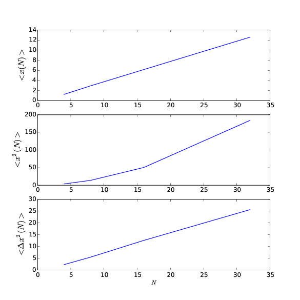

.. _12-1-label:

===============================================================================
問題12.1 - 離散的な時間の1次元ランダムウォーク
===============================================================================

.. contents::

シミュレーションの目的
============================

本シミュレーションでは、ランダムウォークの最も簡単な場合として、並進対称な1次元の格子上を一定の時間間隔で遷移するモデルを考える。ランダムウォークの分散について知られていることとして、十分大きな\ :math:`N`\ に対して\ :math:`<\Delta x^{2}(N)>`\ はべき乗則

.. math:: <\Delta x^{2}(N)> \sim N^{2\nu}
    :label: e1

を満たす。ここで記号\ :math:`\sim`\ は"漸近的に等しい"ことを意味し、式\ :eq:`e1`\ は漸近的なスケーリング則の1例となっている。今簡単な1次元ランダムウォークのモデル(右と左に進む確率が等しいとき)では、すべての\ :math:`N`\ で式\ :eq:`e1`\ が成り立ち、\ :math:`\nu = 1/2`\ となる。

作成したプログラム
=============================
Pythonを用いて作成したプログラムを以下に示す。

* 1次元ランダムウォークのシミュレーション( :download:`12-1_random_walk_d1.py <12-1_random_walk_d1.py>` )

このプログラムでは、右に遷移する確率をprobとして指定し、numpyモジュールの乱数生成メソッドを用いて、ランダムな[0,1)の数を配列pに格納している。各ステップごとにprobの値と乱数の値とを比較して、右か左にlだけ変化させた値を次の時間での変位として記録する(今はl=1)。関数calc_aveでは、\ :math:`<x(N)>`\ 、\ :math:`<x^{2}(N)>`\ の値を計算する。関数showを用いると、上の計算結果をもちいて、\ :math:`N`\ に対する\ :math:`<x(N)>`\ 、\ :math:`<x^{2}(N)>`\ 、\ :math:`<\Delta x^{2}(N)>`\ のグラフを表示することができる。関数caluculate_errorは問題bで使用し、引数に与えた整数値までのランダムウォークの計算を行って、試行回数を増やしていったときに\ :math:`<\Delta x^{2}(N)>`\ の精度が1％未満になっているかどうかを判定する。

.. literalinclude:: 12-1_random_walk_d1.py
    :language: python
    :linenos:

実習課題
=====================

a. 右に動く確率を\ :math:`p=0.7`\ とする。\ :math:`<x(N)>`\ と\ :math:`<x^{2}(N)>`\ を\ :math:`N=4,8,16,32`\ について計算せよ。この場合の\ :math:`<x(N)>`\ はどのように説明できるか。\ :math:`<\Delta x^{2}(N)>`\ がどう\ :math:`N`\ に依存するか定性的に答えよ。\ :math:`<x^{2}(N)>`\ は単純な\ :math:`N`\ 依存性を示すか。
 
:math:`<x(N)>`\ と\ :math:`<x^{2}(N)>`\ 、\ :math:`<\Delta x^{2}(N)>`\ について、\ :math:`\mathrm{nwalkers}=1000`\ としてそれぞれの\ :math:`N`\ について計算を行い、この結果を横軸を\ :math:`N`\ としてグラフにしたものを\ :num:`図#fig-12-1-f1`\ に示す。このグラフから読み取れることとして、まず、\ :math:`<x(N)>`\ は\ :math:`N`\ に対して線形に増加しており、これは以下のような簡単な計算の結果と一致している。また、傾きの大きさも\ :math:`2p-1=0.4`\ となっていることが分かる。

.. math::
    
    <x(N)>  &= \sum_{i=1}^{N}\{ p\times 1 + (1-p)\times (-1)\} \\
    &= \sum_{i=1}^{N}(2p-1) = (2p-1)N

次に、\ :math:`<\Delta x^{2}(N)>`\ については、\ :math:`N`\ の1乗に比例していることが見て取れる(すなわち\ :math:`\nu = 1/2`\ である)。これも、一般の場合に\ :math:`< \Delta x^{2}(N)> =4pql^{2}N`\ と表せることと合致している。

.. _fig-12-1-f1:

    
    \ :math:`N`\ に対する\ :math:`<x(N)>`\ と\ :math:`<x^{2}(N)>`\ 、\ :math:`<\Delta x^{2}(N)>`\ のグラフ

b. 第11.4節で述べた誤差解析の方法を用いて、\ :math:`N=8`\ と\ :math:`N=32`\ の場合の\ :math:`<\Delta x^{2}(N)>`\ を精度1％で得るために必要な試行の回数を求めよ。

(a)で述べたように、解析的に\ :math:`<\Delta x^{2}(N)>`\ の値は求められるので、その値を真の値\ :math:`< \Delta x^{2}(8)> _{0} = 4 \times 0.7 \times 0.3 \times 8 = 6.72`\ 、\ :math:`< \Delta x^{2}(32)> _{0} = 4 \times 0.7 \times 0.3 \times 32 = 26.88`\ として、それとの相対誤差が1％となるような試行回数Mを求めればよい。すなわち標準誤差を\ :math:`\sigma_{m}`\ として

.. math:: \frac{\sigma_{m}}{< \Delta x^{2}(N)> _{0}} \times 100 \leq 1 \sigma_{m} \leq 0.01 <\Delta x^{2}(N)> 

となる。ここで、\ :ref:`付録 <12-1-huroku>`\ に示すように、\ :math:`N`\ 回の試行を行う1回の測定で得られた分散を\ :math:`\sigma`\ とすると

.. math:: \sigma_{m} = \frac{\sigma}{\sqrt{n}}

が成り立つので、これを代入すると(\ :math:`N`\ を\ :math:`M`\ と読み替えて)

.. math:: M \geq \left( \frac{\sigma\times 100}{< \Delta x^{2}(N)>_{0}}\right) ^{2}
    :label: e2

が得られる。\ :math:`\sigma`\ が\ :math:`M`\ の関数として決まっている場合は、\ :math:`M`\ の値を解析的に求めることができるが、今の場合\ :math:`\sigma`\ を\ :math:`M`\ の関数として求める方法はわからない。したがって、\ :math:`M`\ の値を2から順に大きくしていき、\ :math:`M`\ の値と式\ :eq:`e2`\ の右辺の計算値とを比較していくことにする。この結果をまとめたものを\ :ref:`表1 <tab-12-1-t1>`\ ,\ :ref:`表2 <tab-12-1-t2>`\ に示す。これらの試行から、\ :math:`<\Delta x^{2}(N)>`\ を精度1％で得るために必要な試行の回数\ :math:`M`\ は、\ :math:`\mathrm{nwalkers}=1000`\ であるときには、\ :math:`N=8`\ のとき\ :math:`M\geq 19`\ 、\ :math:`N=32`\ のとき\ :math:`M\geq 26`\ ほどであれば良いことが分かる。それより小さい\ :math:`M`\ では、精度1％で求められることもあるが、下限値として適切ではない。

.. _tab-12-1-t1:

.. csv-table::\ :math:`N=8`\ のとき、\ :math:`M`\ と式\ :eq:`e2`\ の右辺との比較(\ :math:`\mathrm{nwalkers}=1000`\ )
    :header: M, 不等号,\ :math:`\\left( \\frac{ \\sigma \\times 100}{< \\Delta x^{2}(N)>_{0}}\\right) ^{2}`\ , count
    
    2 ,\ :math:`<`\ , 11.7080095291 , ""
    3 ,\ :math:`<`\ , 10.5683527683 ,""
    4 ,\ :math:`<`\ , 5.6449783206 ,""
    5 ,\ :math:`<`\ , 13.1767199401 ,""
    6 ,\ :math:`<`\ , 9.31017539915 ,""
    7 ,\ :math:`<`\ , 11.298006385 ,""
    8 ,\ :math:`<`\ , 11.6122000702 ,""
    9 ,\ :math:`<`\ , 11.8588271339 ,""
    10 ,\ :math:`<`\ , 13.2805462695 , ""
    11 ,\ :math:`>`\ , 5.40663459242 , 1
    12 ,\ :math:`>`\ , 11.6587313198 , 2
    13 ,\ :math:`>`\ , 5.20198341922 , 3
    14 ,\ :math:`<`\ , 14.0913796119 , ""
    15 ,\ :math:`>`\ , 13.2349559502 , 4 
    16 ,\ :math:`>`\ , 9.20886425624 , 5 
    17 ,\ :math:`>`\ , 10.1345045153 , 6 
    18 ,\ :math:`<`\ , 18.5593052103 , ""
    19 ,\ :math:`>`\ , 11.0536600843 , 7
    20 ,\ :math:`>`\ , 11.5386838619 , 8
    21 ,\ :math:`>`\ , 13.1460283992 , 9 
    22 ,\ :math:`>`\ , 8.39227718357 , 10 
    23 ,\ :math:`>`\ , 15.8071381158 , 11 
    24 ,\ :math:`>`\ , 8.9317879812 , 12 
    25 ,\ :math:`>`\ , 17.2226656569 , 13 
    26 ,\ :math:`>`\ , 12.3538617431 , 14 
    27 ,\ :math:`>`\ , 11.7846823015 , 15

.. _tab-12-1-t2:

.. csv-table::\ :math:`N=32`\ のとき、\ :math:`M`\ と式\ :eq:`e2`\ の右辺との比較(\ :math:`\mathrm{nwalkers}=1000`\ )
    :header: M, 不等号,\ :math:`\\left( \\frac{ \\sigma \\times 100}{< \\Delta x^{2}(N)>_{0}}\\right) ^{2}`\ , count

    2 ,\ :math:`>`\ , 0.32149282727 , 1
    3 ,\ :math:`>`\ , 1.02405794329 , 2
    4 ,\ :math:`<`\ , 30.0521604962 ,
    5 ,\ :math:`<`\ , 7.13793428824 ,
    6 ,\ :math:`<`\ , 17.593509665 ,
    7 ,\ :math:`<`\ , 17.952294418 ,
    8 ,\ :math:`>`\ , 5.56611217356 , 3
    9 ,\ :math:`<`\ , 13.868141118 ,
    10 ,\ :math:`<`\ , 17.3761782997 ,
    11 ,\ :math:`>`\ , 10.5719588472 , 4
    12 ,\ :math:`<`\ , 17.9530873904 ,
    13 ,\ :math:`<`\ , 17.977542833 ,
    14 ,\ :math:`<`\ , 21.0129775506 ,
    15 ,\ :math:`<`\ , 16.105658749 ,
    16 ,\ :math:`<`\ , 17.2696667207 ,
    17 ,\ :math:`<`\ , 29.1796778766 ,
    18 ,\ :math:`>`\ , 17.1884240052 , 5
    19 ,\ :math:`>`\ , 14.4165685045 , 6
    20 ,\ :math:`>`\ , 16.5500505218 , 7
    21 ,\ :math:`>`\ , 9.49101301793 , 8
    22 ,\ :math:`>`\ , 10.7188319627 , 9
    23 ,\ :math:`<`\ , 29.1758785194 ,
    24 ,\ :math:`>`\ , 13.1087274658 , 10 
    25 ,\ :math:`<`\ , 26.9290290068 , 
    26 ,\ :math:`>`\ , 20.6962324661 , 11
    27 ,\ :math:`>`\ , 21.9648359983 , 12
    28 ,\ :math:`>`\ , 20.7435187729 , 13
    29 ,\ :math:`>`\ , 18.3682158692 , 14
    30 ,\ :math:`>`\ , 24.8443920402 , 15

まとめ
=======================

このシミュレーションでは、離散時間の1次元ランダムウォークの簡単な例を実施することができた。また、測定の精度を上げるために試行回数を増やすことなど、定量的な誤差について学ぶ機会となった。

.. _12-1-huroku:

付録: 平均値の標準偏差
===========================

:math:`\sigma`\ を測定の標準偏差とすると、\ :math:`N`\ 回の試行からなる単独の測定の誤差が\ :math:`\sigma/\sqrt n`\ に等しくなることを、解析的に導く。注目する測定量を\ :math:`x`\ で表し、それぞれが\ :math:`N`\ 回の試行からなる\ :math:`M`\ 組の、合計して\ :math:`mn`\ 回の試行からなる測定の組を考える。特定の測定を表すために添字\ :math:`\alpha`\ を使い、ある測定の\ :math:`i`\ 回目の試行を表すために添字\ :math:`i`\ を用いる。測定\ :math:`\alpha`\ の\ :math:`i`\ 回目の試行の結果を\ :math:`x_{\alpha, i}`\ で表すと、測定の値は

.. math:: M_{\alpha} = \frac{1}{n}\sum_{\alpha = 1}^{n}x_{\alpha, i}    

で与えられる。さらに\ :math:`mn`\ 回のすべての試行についての平均\ :math:`\bar{M}`\ は

.. math:: \bar{M} = \frac{1}{m}\sum_{\alpha=1}^{m}M_{\alpha} = \frac{1}{mn} \sum_{\alpha}^{m}\sum_{i=1}^{n} x_{\alpha , i}

となる。\ :math:`\alpha`\ 番目の測定値とすべての測定の平均値との差は

.. math:: e_{\alpha} = M_{\alpha} - \bar{M}

である。平均値の分散は

.. math:: \sigma_{m}^{2} = \frac{1}{m}\sum_{\alpha=1}^{m} e_{\alpha}^{2}
    :label: e3

と書くことができる。

\ :math:`\sigma_{m}`\ と各測定の試行の分散との関係を調べることにしよう。個々の試行結果\ :math:`x_{\alpha, i}`\ と平均値との差\ :math:`d_{\alpha, i}`\ は

.. math:: d_{\alpha, i} = x_{\alpha, i} - \bar{M}

で与えられる。したがって、\ :math:`mn`\ 回の試行についての分散\ :math:`\sigma^{2}`\ は

.. math:: \sigma^{2} = \frac{1}{mn}\sum_{\alpha = 1}^{m}\sum_{i=1}^{n}d_{\alpha, i}^{2}
    :label: e7

である。また、

.. math::
    e_{\alpha} = M_{\alpha} - \bar{M} &= \frac{1}{n}\sum_{i=1}^{n}(x_{\alpha, i} - \bar{M}) \\
                                      &= \frac{1}{n}\sum_{i=1}^{n}d_{\alpha, i}
    :label: e4

である。したがって、式\ :eq:`e4`\ を\ :eq:`e3`\ に代入すると、

.. math:: \sigma_{m}^{2} = \frac{1}{m}\sum_{\alpha - 1}^{m}\left( \frac{1}{n}\sum_{i=1}^{n}d_{\alpha, i}\right) \left( \frac{1}{n}\sum_{j = 1}^{n}d_{\alpha, j} \right)
    :label: e5

が得られる。式\ :eq:`e5`\ の組\ :math:`\alpha`\ についての試行\ :math:`i`\ ,\ :math:`j`\ に関する和には2種類の項、つまり、\ :math:`i=j`\ の項と\ :math:`i\neq j`\ の項が含まれている。\ :math:`d_{\alpha, i}`\ と\ :math:`d_{\alpha, j}`\ は互いに独立で、平均値としては正と負の値を同程度に取ることが予想されるので、測定回数の大きい極限では、式\ :eq:`e5`\ で\ :math:`i=j`\ の項だけが和に寄与すると考えてよいだろう。したがって、

.. math:: \sigma_{m}^{2} = \frac{1}{mn^{2}}\sum_{\alpha=1}^{m}\sum_{i = 1}^{n}d_{\alpha, i}
    :label: e6

と書く。式\ :eq:`e6`\ と\ :eq:`e7`\ を組み合わせると、求めていた式

.. math:: \sigma_{m}^{2} = \frac{\sigma^{2}}{n}

が導かれる。

追記: <x^{2}(N)>の解析的な値
=========================================================================

問題aでは\ :math:`N`\ に対する\ :math:`<x^{2}(N)>`\ について\ :num:`図#fig-12-1-f1`\ を用いて定性的に述べたが、これを解析的に求めるとするとどうなるか。確率pで右に移動し、確率qで左に移動する場合を考えると、このとき\ :math:`x^{2}(N)`\ は2つの項の和で表すことができて、\ :math:`x_{0}=0`\ ならば

.. math:: x^{2}(N) = \sum_{i=1}^{N}s_{i}^{2} + \sum_{i\neq j=1}^{N}s_{i}s_{j}

である。ここで\ :math:`s_{i} = \pm l`\ とする。上の式を利用して\ :math:`x^{2}(N)`\ の期待値を計算すると、

.. math:: <x^{2}(N)> = \sum_{i=1}^{N}\left[ p(+l)^{2}+q(-l)^{2} \right]  + \sum_{i\neq j=1}^{N}\left[ p(+l)+q(-l) \right]^{2}

である。右辺第2項の和は、\ :math:`(i,j)`\ の組み合わせ(区別できる)から\ :math:`i=j`\ の場合の\ :math:`N`\ 通りを除いた数だけの場合があるので

.. math:: <x^{2}(N)> = N(p+q)l^{2} + N(N-1)(p-q)^{2}l^{2}

となる。したがって

.. math:: 
    <x^{2}(N)> &= Nl^{2} + N(N-1)(p-q)^{2}l^{2} \\
    &= Nl^{2}\left[ (p+q)^{2}-(p-q)^{2} \right] + N^{2}(p-q)^{2}l^{2} \\
    &= 4pql^{2}N + N^{2}(p-q)^{2}l^{2}

である。また、これより\ :math:`<\Delta x^{2}(N)>`\ は

.. math:: 
    <\Delta x^{2}(N)> &= <x^{2}(N)>-(<x(N)>)^{2} = 4pql^{2}N + N^{2}(p-q)^{2}l^{2} - N^{2}(p-q)^{2}l^{2} \\
    &= 4pql^{2}N

と求められる。以上から\ :math:`<x^{2}(N)>`\ はNの2乗に比例しており、実際にシミュレーションで行った\ :math:`\alpha=0.7`\ 、\ :math:`N=30`\ のときの値を計算してみると、\ :math:`<x^{2}(30)>=4\times 0.7 \times 0.3 \times 30 + 30^{2}(0.7-0.3)^{2} = 169.2`\ であり、\ :num:`図#fig-12-1-f1`\ で見た値と一致していることが確かめられる。

参考文献
============================

* ハーベイ・ゴールド,ジャン・トボチニク,石川正勝・宮島佐介訳『計算物理学入門』,ピアソン・エデュケーション, 2000.

* 鈴木武・山田作太郎著『数理統計学―基礎から学ぶデータ解析―』, 内田老鶴圃, 2008.

